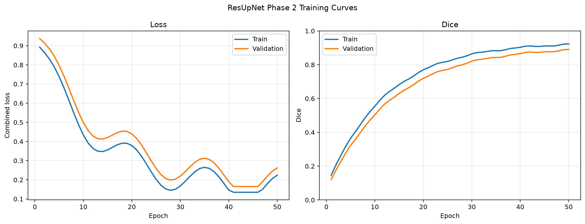
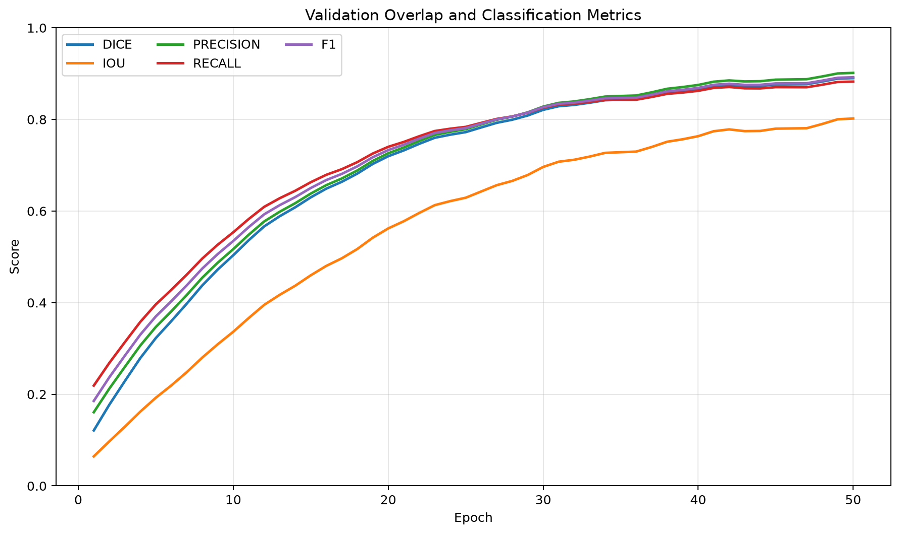
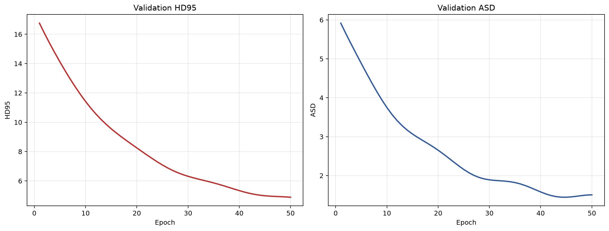
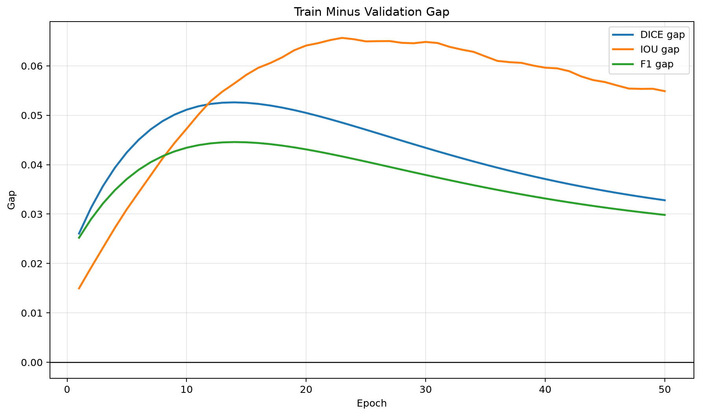
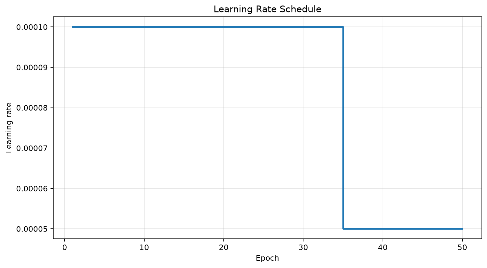
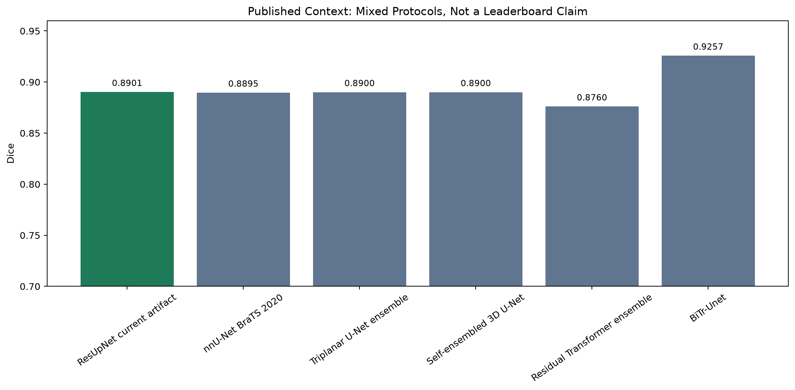

# ResUpNet Phase 2 Metrics Validation Report

Generated: 2026-06-19 01:09:38

## Executive Verdict

The two result artifacts are **validated** under artifact-level checks. The full 50-epoch curve supports a final validation Dice of **0.890146**, IoU of **0.802039**, F1 of **0.891956**, HD95 of **4.8877**, and ASD of **1.5056** at epoch **50**.

This is strong internal selected-slice evidence. It is not, by itself, proof of official BraTS full-volume superiority because the current protocol uses 2D selected slices at 160x160 and binary whole-tumor masks.

## Inputs

| Artifact | Role | Status |
| --- | --- | --- |
| `resupnet_training_curve.json` | Full 50-epoch training and validation curve | Primary source for validation and plots |
| `training_history_rows.json` | Compact selected-row summary | Cross-check source for epochs 1, 2, and 50 |

## Experiment Context

| Field | Value |
| --- | --- |
| experiment_name | ResUpNet_BraTS2021_Multimodal_ROI |
| task | brain_tumor_segmentation |
| model | ResUpNet |
| dataset | BraTS 2021 |
| input_type | multimodal_mri |
| image_size | 160x160 |
| total_epochs | 50 |
| created_at | 2026-06-17 |

## Validation Checks

| Check | Result | Detail |
| --- | --- | --- |
| full curve JSON parsed | PASS | Loaded resupnet_training_curve.json. |
| compact history JSON parsed | PASS | Loaded training_history_rows.json. |
| full curve has 50 epochs | PASS | Found 50 full-curve epochs. |
| epoch sequence is continuous | PASS | Epoch sequence is [1, 2, 3]...[48, 49, 50]. |
| metric ranges are valid | PASS | All score metrics are in [0, 1], loss/distances are non-negative, and LR is positive. |
| F1 and Dice/IoU identities hold | PASS | F1 equals 2PR/(P+R), and Dice equals 2IoU/(1+IoU), within rounding tolerance. |
| summary.initial_epoch matches curve | PASS | All nested values match the corresponding epoch row. |
| summary.final_epoch matches curve | PASS | All nested values match the corresponding epoch row. |
| overall progress recomputes | PASS | All improvement/reduction values recompute from epoch 1 and epoch 50. |
| final generalization gap recomputes | PASS | Final train-minus-validation gaps match the full curve. |
| best checkpoint claims recompute | PASS | Best Dice/IoU/HD95 at epoch 50; best loss at epochs [41, 42, 43, 44, 45, 46]; best ASD at epoch 45. |
| compact rows match full curve for shared epochs | PASS | Epochs present in both artifacts have matching metric values. |
| experiment metadata matches across artifacts | PASS | Shared experiment metadata fields are consistent. |

## Warnings

- training_history_rows.json contains 3 selected epoch rows, not the full 50-epoch curve. Use resupnet_training_curve.json for plots and trend analysis.

## Metric Summary

| Metric | Epoch 1 validation | Epoch 50 validation | Absolute change | Relative change |
| --- | ---: | ---: | ---: | ---: |
| Dice | 0.120967 | 0.890146 | 0.769179 | 635.86% |
| IoU | 0.064377 | 0.802039 | 0.737662 | 1145.85% |
| Loss | 0.937407 | 0.262043 | -0.675364 | -72.05% |
| HD95 | 16.753700 | 4.887700 | -11.866000 | -70.83% |
| ASD | 5.915000 | 1.505600 | -4.409400 | -74.55% |

For lower-is-better metrics, the negative relative change means improvement. The reductions are loss **72.05%**, HD95 **70.83%**, and ASD **74.55%**.

## Final Epoch Quality

| Split | Loss | Dice | IoU | Precision | Recall | F1 | Specificity | Accuracy | HD95 | ASD |
| --- | ---: | ---: | ---: | ---: | ---: | ---: | ---: | ---: | ---: | ---: |
| Train | 0.223926 | 0.922947 | 0.856920 | 0.930504 | 0.913239 | 0.921790 | 0.995603 | 0.993713 | n/a | n/a |
| Validation | 0.262043 | 0.890146 | 0.802039 | 0.901572 | 0.882543 | 0.891956 | 0.993046 | 0.990363 | 4.8877 | 1.5056 |

Final train-minus-validation Dice gap is **0.032801**. That gap is small enough to support a stable internal-validation interpretation, while still requiring test/full-volume confirmation before publication-grade claims.

## Best Checkpoints

| Selection rule | Artifact result | Interpretation |
| --- | --- | --- |
| Best validation Dice | Epoch 50, Dice 0.890146 | Best overlap checkpoint |
| Best validation IoU | Epoch 50, IoU 0.802039 | Same checkpoint as best Dice |
| Best validation loss | Epochs [41, 42, 43, 44, 45, 46], loss 0.165000 | Loss plateau precedes best Dice; select by Dice for segmentation overlap |
| Best HD95 | Epoch 50, HD95 4.8877 | Best boundary outlier distance |
| Best ASD | Epoch 45, ASD 1.4439 | Lowest average surface distance, slightly before final Dice peak |

## Plots













## Why The Present Structure Can Produce Better Results

The current result is plausible because the current native PyTorch structure is materially stronger than the earlier project baseline and many simple 2D U-Net style setups:

- Four MRI modalities are used together: T1, T1ce, T2, and FLAIR. This gives the model complementary contrast information instead of forcing it to infer tumor extent from a single channel.
- The split is patient-wise with no overlap, which removes a common leakage failure mode in slice-based medical imaging experiments.
- The input pipeline uses image-intensity ROI cropping, not mask-based cropping, so the crop does not leak label geometry while still reducing irrelevant background.
- Tumor, near-tumor, and hard-negative slices are retained. That helps the model learn boundary ambiguity and false-positive suppression, not only obvious tumor slices.
- The model is a residual encoder-decoder with attention gates and an ASPP bottleneck. Residual blocks improve gradient flow, attention gates filter skip features, and ASPP adds multi-scale context for variable tumor sizes.
- The active loss combines Dice, focal Tversky, boundary loss, and BCE. That directly targets overlap, class imbalance, boundary quality, and pixel-level calibration together.
- The trainer supports conservative MRI augmentation, gradient clipping, mixed precision, EMA checkpoints, and resume-safe optimizer/scheduler/scaler state. These controls improve stability on native Windows CUDA hardware.

## Published Context

| Work | Reported metric | Reported value | Our artifact value | What can be said |
| --- | --- | ---: | ---: | --- |
| [nnU-Net BraTS 2020](https://arxiv.org/abs/2011.00848) | WT Dice | 0.8895 | 0.8901 | Numerically similar WT Dice and lower HD95 in our artifact, but protocols differ. |
| [Triplanar U-Net ensemble](https://arxiv.org/abs/2105.11356) | WT Dice | 0.8900 | 0.8901 | Numerically comparable WT Dice, protocol differs. |
| [Self-ensembled 3D U-Net](https://arxiv.org/abs/2011.01045) | WT Dice | 0.8900 | 0.8901 | Numerically comparable WT Dice and lower HD95 in our artifact, protocol differs. |
| [Residual Transformer ensemble](https://arxiv.org/abs/2308.00128) | Mean Dice | 0.8760 | 0.8901 | Our selected-slice Dice is numerically higher than this mean Dice, but mean-region and WT Dice are not interchangeable. |
| [BiTr-Unet](https://arxiv.org/abs/2109.12271) | WT Dice | 0.9257 | 0.8901 | Published full-volume result is stronger; use as upper context, not as a paper we beat. |

The strongest defensible statement is: **under the current selected-slice validation protocol, ResUpNet reaches a Dice value that is numerically competitive with several published whole-tumor Dice results and stronger than the project's earlier internal baselines, while using a native PyTorch pipeline tuned for the available system.**

The strongest statement that is **not** yet defensible is: **this is better than all BraTS papers or official full-volume BraTS state of the art.** BiTr-Unet, for example, reports stronger BraTS 2021 full-volume WT Dice and HD95 than this artifact.

## Native-System Limitations

- The current artifacts validate a 2D selected-slice protocol, not full 3D patient-volume inference.
- Input size is 160x160 because of local storage and VRAM constraints; this may lose fine boundary detail compared with 192, 224, or 256 crops.
- The task is binary whole-tumor segmentation, not full BraTS subregion segmentation for ET, TC, and WT.
- The artifact-level proof does not include the matching checkpoint, run directory, evaluator output, or test-set summary. Those are required for publication-grade reproducibility.
- The validation loss minimum occurs before the final Dice maximum, so final checkpoint selection should explicitly prioritize Dice/IoU if overlap quality is the main objective.

## Claim Boundary

Safe claim:

> The checked-in Phase 2 result artifacts are internally consistent and show validation Dice improving from 0.120967 to 0.890146 over 50 epochs under the project's BraTS 2021 selected-slice binary whole-tumor protocol.

Safe competitive-positioning claim:

> The selected-slice validation Dice is numerically competitive with several published whole-tumor Dice values, but this is a contextual comparison only because published BraTS papers generally use full-volume challenge protocols.

Unsafe claim until more evidence exists:

> This checkpoint is the best BraTS 2021 model overall, or it beats official full-volume BraTS 2021 methods.

## Reproducibility

Regenerate this report and all plots with:

```powershell
.\.venv\Scripts\python.exe generate_phase2_artifact_report.py
```

Outputs:

- `reports/phase2_metrics_validation/metrics_validation_summary.json`
- `reports/phase2_metrics_validation/RESUPNET_PHASE2_RESULTS_REPORT.md`
- `reports/phase2_metrics_validation/plots/*.png`

## References

- BraTS 2021 benchmark: https://arxiv.org/abs/2107.02314
- nnU-Net for Brain Tumor Segmentation: https://arxiv.org/abs/2011.00848
- Triplanar ensemble of U-Nets: https://arxiv.org/abs/2105.11356
- Self-ensembled deeply-supervised 3D U-Net: https://arxiv.org/abs/2011.01045
- BiTr-Unet: https://arxiv.org/abs/2109.12271
- Residual Transformer ensemble: https://arxiv.org/abs/2308.00128
